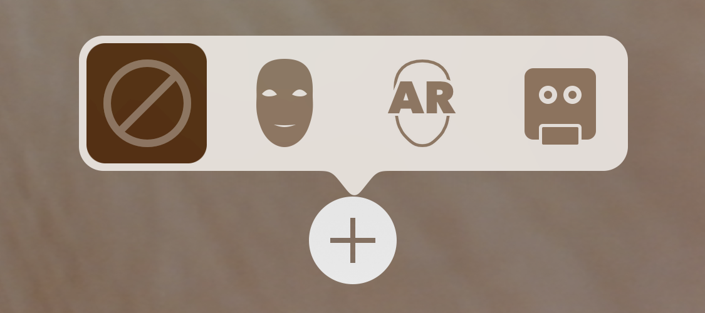

# Creating Face-Based AR Experiences

Place and animate 3D content that follows the user's face and matches facial expressions, using the TrueDepth camera on iPhone X.

## Overview

This sample app presents a simple interface allowing you to choose between four augmented reality (AR) visualizations on devices with a TrueDepth front-facing camera (see [iOS Device Compatibility Reference][11]).

[11]:https://developer.apple.com/library/content/documentation/DeviceInformation/Reference/iOSDeviceCompatibility/Cameras/Cameras.html#//apple_ref/doc/uid/TP40013599-CH107-SW1

- The camera view alone, without any AR content.
- The face mesh provided by ARKit, with automatic estimation of the real-world directional lighting environment.
- Virtual 3D content that appears to attach to (and be obscured by parts of) the user's real face.
- A simple robot character whose facial expression is animated to match that of the user.

Use the "+" button in the sample app to switch between these modes, as shown below.



## Getting Started

ARKit face tracking requires iOS 11 and an iOS device with a TrueDepth front-facing camera (see [iOS Device Compatibility Reference][11]). ARKit is not available in iOS Simulator.

## Start a Face Tracking Session in a SceneKit View

Like other uses of ARKit, face tracking requires configuring and running a session (an [`ARSession`][0] object) and rendering the camera image together with virtual content in a view. For more detailed explanations of session and view setup, see [About Augmented Reality and ARKit][1] and [Building Your First AR Experience][3]. This sample uses SceneKit to display an AR experience, but you can also use SpriteKit or build your own renderer using Metal (see [ARSKView][2] and [Displaying an AR Experience with Metal][4]).

[0]:https://developer.apple.com/documentation/arkit/arsession
[1]:https://developer.apple.com/documentation/arkit/about_augmented_reality_and_arkit
[2]:https://developer.apple.com/documentation/arkit/arskview
[3]:https://developer.apple.com/documentation/arkit/building_your_first_ar_experience
[4]:https://developer.apple.com/documentation/arkit/displaying_an_ar_experience_with_metal

Face tracking differs from other uses of ARKit in the class you use to configure the session. To enable face tracking, create an instance of [`ARFaceTrackingConfiguration`][5], configure its properties, and pass it to the [`run(_:options:)`][6] method of the AR session associated with your view, as shown below.

[5]:https://developer.apple.com/documentation/arkit/arfacetrackingconfiguration
[6]:https://developer.apple.com/documentation/arkit/arsession/2875735-run

``` swift
guard ARFaceTrackingConfiguration.isSupported else { return }
let configuration = ARFaceTrackingConfiguration()
configuration.isLightEstimationEnabled = true
session.run(configuration, options: [.resetTracking, .removeExistingAnchors])
```
[View in Source](x-source-tag://ARFaceTrackingSetup)

Before offering your user features that require a face tracking AR session, check the [`isSupported`][7] property on the [`ARFaceTrackingConfiguration`][5] class to determine whether the current device supports ARKit face tracking.

[7]:https://developer.apple.com/documentation/arkit/arconfiguration/2923553-issupported

## Track the Position and Orientation of a Face

When face tracking is active, ARKit automatically adds [`ARFaceAnchor`][8] objects to the running AR session, containing information about the user's face, including its position and orientation. 

[8]:https://developer.apple.com/documentation/arkit/arfaceanchor

- Note: ARKit detects and provides information about only one user's face. If multiple faces are present in the camera image, ARKit chooses the largest or most clearly recognizable face.

In a SceneKit-based AR experience, you can add 3D content corresponding to a face anchor in the [`renderer(_:didAdd:for:)`][10] method (from the [`ARSCNViewDelegate`][9] protocol). ARKit adds a SceneKit node for the anchor, and updates that node's position and orientation on each frame, so any SceneKit content you add to that node automatically follows the position and orientation of the user's face. 

[9]:https://developer.apple.com/documentation/arkit/arscnviewdelegate
[10]:https://developer.apple.com/documentation/arkit/arscnviewdelegate/2865794-renderer

``` swift
func renderer(_ renderer: SCNSceneRenderer, didAdd node: SCNNode, for anchor: ARAnchor) {
    // Hold onto the `faceNode` so that the session does not need to be restarted when switching masks.
    faceNode = node
    serialQueue.async {
        self.setupFaceNodeContent()
    }
}
```
[View in Source](x-source-tag://ARNodeTracking)

In this example, the [`renderer(_:didAdd:for:)`][10] method calls the [`setupFaceNodeContent`](x-source-tag://FaceContentSetup) method to add SceneKit content to the [`faceNode`](x-source-tag://FaceNode). For example, if you change the [`showsCoordinateOrigin`](x-source-tag://ShowCoordinateOrigin) variable in the sample code, the app adds a visualization of the x/y/z axes to the node, indicating the origin of the face anchor's coordinate system.

## Use Face Geometry to Model the User's Face

ARKit provides a coarse 3D mesh geometry matching the size, shape, topology, and current facial expression of the user's face. ARKit also provides the [`ARSCNFaceGeometry`][12] class, offering an easy way to visualize this mesh in SceneKit.

[12]:https://developer.apple.com/documentation/arkit/arscnfacegeometry

Your AR experience can use this mesh to place or draw  content that appears to attach to the face. For example, by applying a semitransparent texture to this geometry you could paint virtual tattoos or makeup onto the user's skin.

To create a SceneKit face geometry, initialize an [`ARSCNFaceGeometry`][12] object with the Metal device your SceneKit view uses for rendering:

``` swift
// This relies on the earlier check of `ARFaceTrackingConfiguration.isSupported`.
let device = sceneView.device!
let maskGeometry = ARSCNFaceGeometry(device: device)!
```
[View in Source](x-source-tag://CreateARSCNFaceGeometry)

The sample code's [`setupFaceNodeContent`](x-source-tag://FaceContentSetup) method (mentioned above) adds a node containing the face geometry to the scene. By making that node a child of the node provided by the face anchor, the face model automatically tracks the position and orientation of the user's face.

To also make the face model onscreen conform to the shape of the user's face, even as the user blinks, talks, and makes various facial expressions, you need to retrieve an updated face mesh in the [`renderer(_:didUpdate:for:)`][13] delegate callback.

[13]:https://developer.apple.com/documentation/arkit/arscnviewdelegate/2865799-renderer

``` swift
func renderer(_ renderer: SCNSceneRenderer, didUpdate node: SCNNode, for anchor: ARAnchor) {
    guard let faceAnchor = anchor as? ARFaceAnchor else { return }
    
    virtualFaceNode?.update(withFaceAnchor: faceAnchor)
}
```
[View in Source](x-source-tag://ARFaceGeometryUpdate)

Then, update the [`ARSCNFaceGeometry`][12] object in your scene to match by passing the new face mesh to its [`update(from:)`][14] method:

[14]:https://developer.apple.com/documentation/arkit/arscnfacegeometry/2928196-update

``` swift
func update(withFaceAnchor anchor: ARFaceAnchor) {
    let faceGeometry = geometry as! ARSCNFaceGeometry
    faceGeometry.update(from: anchor.geometry)
}
```
[View in Source](x-source-tag://SCNFaceGeometryUpdate)

## Place 3D Content on the User's Face

Another use of the face mesh that ARKit provides is to create *occlusion geometry* in your scene. An occlusion geometry is a 3D model that doesn't render any visible content (allowing the camera image to show through), but obstructs the camera's view of other virtual content in the scene. 

This technique creates the illusion that the real face interacts with virtual objects, even though the face is a 2D camera image and the virtual content is a rendered 3D object. For example, if you place an occlusion geometry and virtual glasses on the user's face, the face can obscure the frame of the glasses.

To create an occlusion geometry for the face, start by creating an [`ARSCNFaceGeometry`][12] object as in the previous example. However, instead of configuring that object's SceneKit material with a visible appearance, set the material to render depth but not color during rendering:

``` swift
geometry.firstMaterial!.colorBufferWriteMask = []
occlusionNode = SCNNode(geometry: geometry)
occlusionNode.renderingOrder = -1
```
[View in Source](x-source-tag://OcclusionMaterial)

Because the material renders depth, other objects rendered by SceneKit correctly appear in front of it or behind it. But because the material doesn't render color, the camera image appears in its place. The sample app combines this technique with a SceneKit object positioned in front of the user's eyes, creating an effect where the object is realistically obscured by the user's nose.

## Animate a Character with Blend Shapes

In addition to the face mesh shown in the above examples, ARKit also provides a more abstract model of the user's facial expressions in the form of a [`blendShapes`][15] dictionary. You can use the named coefficient values in this dictionary to control the animation parameters of your own 2D or 3D assets, creating a character (such as an avatar or puppet) that follows the user's real facial movements and expressions.

[15]:https://developer.apple.com/documentation/arkit/arfaceanchor/2928251-blendshapes

As a basic demonstration of blend shape animation, this sample includes a simple model of a robot character's head, created using SceneKit primitive shapes. (See the `robotHead.scn` file in the source code.) 

To get the user's current facial expression, read the [`blendShapes`][15] dictionary from the face anchor in the [`renderer(_:didUpdate:for:)`][13] delegate callback:

``` swift
func update(withFaceAnchor faceAnchor: ARFaceAnchor) {
    blendShapes = faceAnchor.blendShapes
}
```
[View in Source](x-source-tag://ARFaceGeometryBlendShapes)

Then, examine the key-value pairs in that dictionary to calculate animation parameters for your model. There are 52 unique [`ARFaceAnchor.BlendShapeLocation`][16] coefficients. Your app can use as few or as many of them as neccessary to create the artistic effect you want. In this sample, the `RobotHead` class performs this calculation, mapping the [`eyeBlinkLeft`][17] and [`eyeBlinkRight`][18] parameters to one axis of the [`scale`][19] factor of the robot's eyes, and the [`jawOpen`][20] parameter to offset the position of the robot's jaw.

[16]:https://developer.apple.com/documentation/arkit/arfaceanchor.blendshapelocation
[17]:https://developer.apple.com/documentation/arkit/arfaceanchor.blendshapelocation/2928261-eyeblinkleft
[18]:https://developer.apple.com/documentation/arkit/arfaceanchor.blendshapelocation/2928262-eyeblinkright
[19]:https://developer.apple.com/documentation/scenekit/scnnode/1408050-scale
[20]:https://developer.apple.com/documentation/arkit/arfaceanchor.blendshapelocation/2928236-jawopen

``` swift
var blendShapes: [ARFaceAnchor.BlendShapeLocation: Any] = [:] {
    didSet {
        guard let eyeBlinkLeft = blendShapes[.eyeBlinkLeft] as? Float,
            let eyeBlinkRight = blendShapes[.eyeBlinkRight] as? Float,
            let jawOpen = blendShapes[.jawOpen] as? Float
            else { return }
        eyeLeftNode.scale.z = 1 - eyeBlinkLeft
        eyeRightNode.scale.z = 1 - eyeBlinkRight
        jawNode.position.y = originalJawY - jawHeight * jawOpen
    }
}
```
[View in Source](x-source-tag://BlendShapeAnimation)
